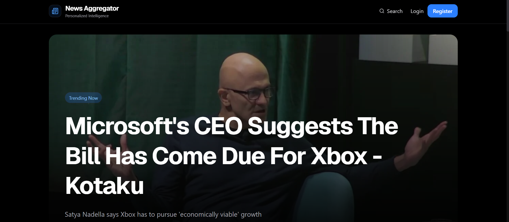

# 📰 News Aggregator

A modern full-stack news platform that aggregates articles from multiple sources, delivers personalized recommendations, and provides a seamless reading experience through intelligent content discovery, bookmarking, and user engagement tracking.

## ✨ Features

### 👤 Authentication & User Management

* Email & password authentication
* Google OAuth login
* Email verification
* Password reset via email
* JWT authentication with refresh tokens
* User profile dashboard

### 📰 News Aggregation

* RSS feed integration
* News API integration
* Automatic article ingestion
* Content extraction & parsing
* Trending article calculation

### 🎯 Personalization

* Personalized article recommendations
* Reading history tracking
* Interest-based content discovery
* Bookmark articles for later reading

### 🔍 Search & Discovery

* Full-text article search
* Category filtering
* Source filtering
* Trending news feed
* Latest news feed

### 📊 Analytics

* Reading history analytics
* User engagement tracking
* Article views & click tracking
* Trending score generation

### 🎨 User Experience

* Responsive design
* Dark modern UI
* Category-based browsing
* Related article suggestions
* Fast article loading

## 🛠️ Tech Stack

### Frontend

* Next.js (App Router)
* React
* TypeScript
* Tailwind CSS
* Axios
* Lucide React
* React Hot Toast

### Backend

* Node.js
* Express.js
* MongoDB
* Mongoose

### Authentication

* JWT Authentication
* Refresh Tokens
* Passport.js
* Google OAuth 2.0

### External Services

* RSS Feeds
* News APIs
* Resend Email Service

### Deployment

* Vercel (Frontend)
* Render (Backend)

## 🧠 Recommendation Engine

Recommendations are generated using:

* User reading history
* Category preferences
* Article popularity
* Trending score
* Recently viewed exclusions

This creates a personalized news feed for each user.

## 👨‍💻 Author

**Sarthak Pattnaik**

* LinkedIn: https://www.linkedin.com/in/sarthak-pattnaik-348ba72a9/
* Portfolio: https://sarthak-pattnaik-portfolio.vercel.app
* GitHub: https://github.com/Sarthak-Pattnaik

## ⭐ Support

If you found this project interesting, consider giving it a star ⭐.
